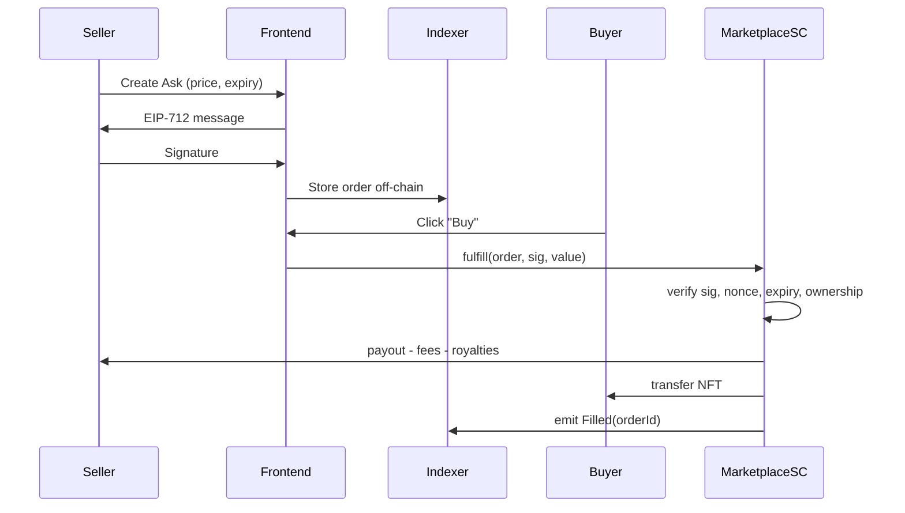
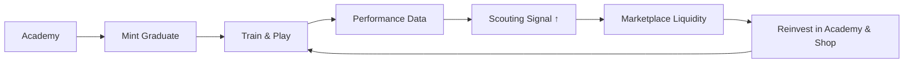
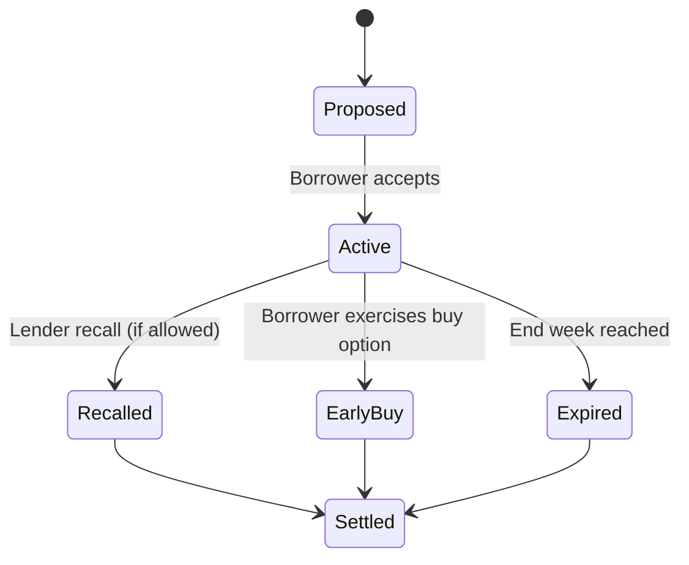

# Marketplace & Club Ops

This page goes deep on how managers mint, list, buy, train, loan, and graduate talent on Gaff and how the economy stays fair, liquid, and fun.

### 5.1 NFT Marketplace

#### What lives on-chain

- **Player NFTs** (ERC-721): unique ID, immutable genesis (academy cohort, origin scout), dynamic attributes (form, stamina, total goals/assists, appearances).
- **Club Badge NFTs** (ERC-721, optional): club identity & cosmetics.
- **Receipts** (ERC-1155 or event logs): tournament entries, prize receipts for verifiable history.

#### Player metadata (example)

```json
{
  "name": "Cristiano Messi (ST, Left)",
  "description": "Academy Class S4 · Brazil · Pressing forward.",
  "image": "ipfs://Qm.../render.png",
  "attributes": [
    { "trait_type": "Position", "value": "ST" },
    { "trait_type": "Foot", "value": "Left" },
    { "trait_type": "Strength", "value": 72 },
    { "trait_type": "Stamina", "value": 83 },
    { "trait_type": "Injury Proneness", "value": 0.18 },
    { "trait_type": "Form (roll-5)", "value": [7, 6, 8, 7, 6] },
    { "trait_type": "Nationality", "value": "BRA" },
    { "trait_type": "Cohort", "value": "ACA-S4" },
    { "trait_type": "Age", "value": 19 }
  ],
  "external_url": "https://gaff.coach/player/12345"
}
```

#### Minting paths

- **New Gen (Primary):**
  - Source: academy graduation, special drops, partner leagues.
  - Supply policy: season-based caps per position & cohort to avoid meta inflation.
  - Randomness: VRF-backed seeding for base profile, club training develops it.
- **Convert Prospects → NFTs (Academy grads):**
  - Triggered when graduation threshold is met (see §6.4).
  - Mint fee covers storage + fraud proofs, discounted via referral.

#### Listing: gasless → on-chain settlement

- **Gasless listing** uses **EIP-712** signatures:
  - Seller signs `{tokenId, collection, minPrice, expiry, nonce}`.
  - Order is stored off-chain (indexer), **no gas**.
  - **On purchase:** buyer calls `fulfill(order, sig),` contract verifies signer, price, expiry, ownership & nonce, then transfers NFT and splits funds.
- **Cancel listing:** seller signs a cancel, indexer prunes, or seller revokes nonce on-chain (optional advanced flow).

**EIP-712 typed data (example)**

```solidity
struct Ask {
  address seller;
  address collection;
  uint256 tokenId;
  uint256 minPrice;
  uint256 expiry;  // unix
  uint256 nonce;
  address payoutCurrency; // native or ERC20
}
```

#### Offers & bids

- **Maker bids** (gasless): bidder signs a bid with price floors/expiry.
- **Taker fills**: seller fills best bid on-chain, contract handles escrow & splits.
- **Collection bids** (optional roadmap): “any ST ≥ strength 70”.

#### Fees & royalties

| Component         | Default | Notes                                                           |
| ----------------- | ------- | --------------------------------------------------------------- |
| Protocol fee      | 1.5%    | Goes to Gaff treasury for tournaments & grants.                 |
| Creator royalty   | 2.0%    | On primary & secondary (respect creator setting, capped at 4%). |
| Referral kickback | 0.5%    | To referrer on _first_ marketplace transaction by referee.      |
| L1/L2 gas         | chain   | Settlement gas at buyer’s cost, listings remain gasless.        |

> Anti-wash: same-wallet or tightly-linked wallets don’t earn referral kickbacks, on-chain heuristics + risk thresholds throttle abuse.

#### Fraud & abuse controls

- Blacklist stolen tokens (integrations), freeze payouts to suspicious sellers until dispute cleared.
- Nonces and per-seller daily cap on order spam to protect indexers.
- Banned price bands for newly minted academy grads (e.g., no <$0.1 for 24h) to reduce bot sniping.

---

### 5.2 Scouting & Signing

#### What matters when scouting

- **Ratings:** strength (overall), position weights, footedness, height archetype.
- **Form:** last 5 match ratings (1–10) rolling.
- **Stamina & Fatigue:** current stamina (0–100) impacts match sim and injury risk.
- **Injury risk:** `risk = proneness × (100 - stamina)/100` (bounded).
- **Discipline:** yellow/red history (affects fair-play tie-breakers in some events).
- **Chemistry hooks:** position fit vs current formation.

#### Scouting UI signals (examples)

- **Reliability index (0–100):** model of availability: low proneness, high stamina habits.
- **Trajectory:** 4-week trend of ratings & stamina management.
- **Role fit:** “Ideal as pressing forward in 4-3-3”, “sub-optimal in 5-3-2”.

#### Contracts & wages (optional, toggle per league)

| Term      | Range             | Effect                                                          |
| --------- | ----------------- | --------------------------------------------------------------- |
| Wage/week | % of treasury     | Impacts club upkeep, non-payment flags player unhappy modifier. |
| Duration  | 2–16 weeks        | Early break penalties (clause) or transfer windows.             |
| Bonuses   | Goals/Assists/Win | Small token payouts, caps to avoid farm.                        |

#### Loan market

- **Parameters:** duration (weeks), recall window (yes/no, week n), wage split (%), optional buy option (price/expiry).
- **Recall rules:**
  - If recallable, lender can recall after recall window, must honor scheduled matches already locked this round.
  - If non-recallable, only club mutual termination with penalty.
- **Collateral (optional):** borrower posts a bond, forfeited on default/abuse.

**Loan Record (on-chain storage)**

```solidity
struct Loan {
  address originalOwner;
  address borrowerClub;
  address collection;
  uint256 tokenId;
  uint64  startWeek;
  uint64  endWeek;
  bool    recallable;
  uint64  recallWeek;  // if recallable
  uint16  wageSplitBps;  // lender share
  uint256 buyOptionPrice; // 0 if none
  uint64  buyOptionExpiry;
}
```

---

---

### Diagrams

**Marketplace Flow (gasless listing → on-chain fill)**



**Club Ops Flywheel**



**Loan Lifecycle**



---

### Dev Notes (implementation hints)

- **Separation of concerns:** marketplace contracts do **not** mutate player attributes, they only transfer and settle. Training & matches are separate systems writing to on-chain stats or off-chain proofs that are pulled into metadata refresh.
- **Indexing:** use order books keyed by `(collection, tokenId)` and `(seller, nonce),` prune on fills/cancels.
- **Oracles:** no price oracles required, settlement uses buyer’s currency (native or whitelisted ERC-20).
- **Events:** emit granular events (`AskCreated`, `AskCancelled`, `AskFilled`, `BidCreated`, `BidFilled`, `LoanCreated`, `LoanRecalled`, `LoanSettled`) for analytics.

---

### FAQ

**Q: Can I list gasless and cancel on-chain later?**\
Yes. Gasless list, if you want an irrevocable cancel, call `invalidate(nonce)` on-chain. Otherwise, UI removal + indexer pruning hides it.

**Q: Do boosts make pay-to-win?**\
No, boosts are capped per account/player, come with cooldowns, and cannot override core attributes. They help **availability** and **consistency**, not raw strength spikes.

**Q: Can I loan with buy option?**\
Yes, price and expiry are part of the loan struct, exercising transfers immediately and settles royalties/fees.
